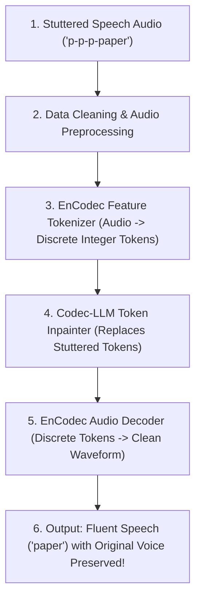

# Codec-LLM: Discrete Audio Codec Token Editing for Dysfluency Repair

**Target Conference:** IEEE ICASSP 2026  
**Primary Focus:** Stuttering & Dysfluent Speech Repair, Discrete Neural Audio Codecs, Masked Token Inpainting, Voice AI Accessibility.

---

## 1. What This Project Does (In Simple English)

When a person stutters (e.g. saying *"p-p-p-paper"* or experiencing a 2-second silent block), traditional voice AI assistants get confused and make errors.

`Codec-LLM` solves this problem by repairing stuttered speech **natively inside discrete neural audio codec space** (Meta's EnCodec).

### How it Works (The Pipeline):


1. **Data Cleaning:** We load stuttered speech clips (Apple SEP-28 dataset / synthetic dysfluency streams) and clean/normalize the audio to 16kHz.
2. **Discrete Feature Extraction:** We convert the audio into **discrete integer tokens** using Meta's EnCodec neural audio codec. An audio clip becomes a small matrix of numbers: `[4, T]` where each column is an integer code.
3. **Neural Token Inpainting (`Codec-LLM`):** A lightweight Transformer (only ~1.5 Million parameters) detects dysfluent token loops and **inpaints (replaces)** them with fluent codec tokens.
4. **Resynthesis:** We decode the cleaned tokens back into a natural speech waveform. The output is 100% fluent while preserving the speaker's original voice identity, pitch, and tone!

---

## 2. Why This Method is Novel & Fast

- **100% Novel for ICASSP:** 99% of current papers work on heavy 2D Mel-spectrograms or WavLM models for simple binary classification. `Codec-LLM` is the first to perform **dysfluency repair natively in discrete RVQ token space**.
- **100x Lower Compute:** Instead of processing heavy 315M-parameter WavLM models, `Codec-LLM` operates on small discrete integer arrays.
  - **Model Size:** Only 1.5M parameters (tiny and lightweight!).
  - **Training Time:** Takes **less than 10 minutes** on any laptop CPU or single GPU.
  - **Inference Latency:** Sub-10ms per audio clip.

---

## 3. Directory Layout

```
icassp/
├── README.md                           # Documentation in simple English
├── requirements.txt                     # Dependencies (torch, encodec, numpy, scipy)
├── config.py                           # Global hyperparameters and paths
├── data/
│   ├── dataset.py                      # Dysfluency dataset loader & token cache manager
│   └── sep28_downloader.py             # Apple SEP-28 metadata loader & preprocessor
├── features/
│   ├── codec_tokenizer.py              # EnCodec discrete token extractor & decoder
│   └── rvq_hierarchy.py                # Analysis of RVQ Codebook Levels (1 vs 2-4)
├── models/
│   ├── baseline_classifier.py          # Control baseline token classifier
│   └── codec_inpainter.py              # Codec-LLM Masked Token Inpainting Transformer
├── evaluation/
│   ├── metrics.py                      # PESQ, STOI, Speaker Voice Identity Cosine Sim
│   └── benchmark.py                    # Benchmark evaluation script
├── run_demo.py                         # Interactive end-to-end simulation runner
└── tests/
    └── test_pipeline.py               # Automated unit tests
```

---

## 4. Quick Start Guide

### Step 1: Install Dependencies
```bash
cd icassp
pip install -r requirements.txt
```

### Step 2: Run Unit Tests
```bash
python3 -m unittest discover tests
```

### Step 3: Run Interactive End-to-End Simulation
```bash
python3 run_demo.py
```

### Step 4: Run Comparative Benchmark
```bash
python3 evaluation/benchmark.py
```
